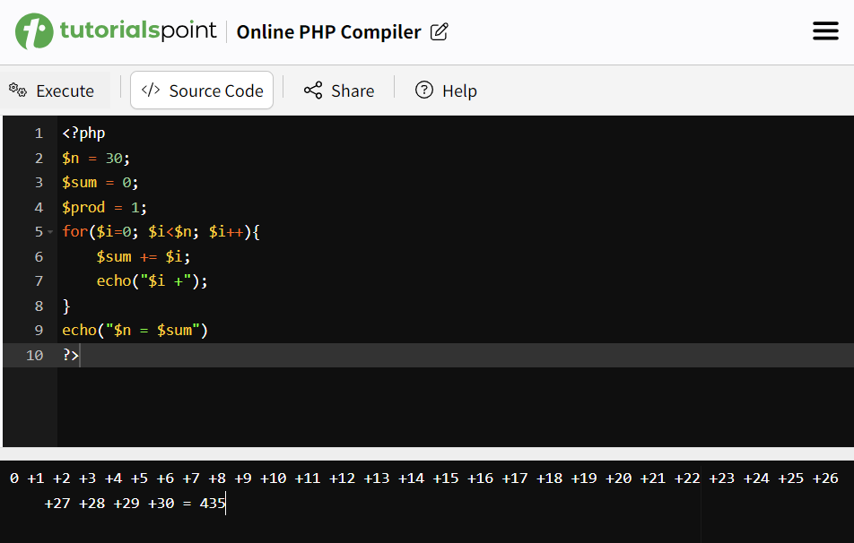
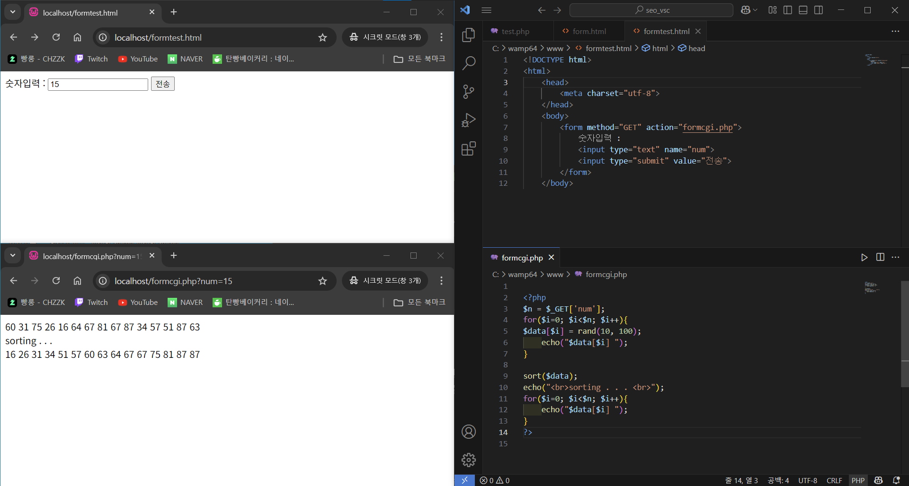
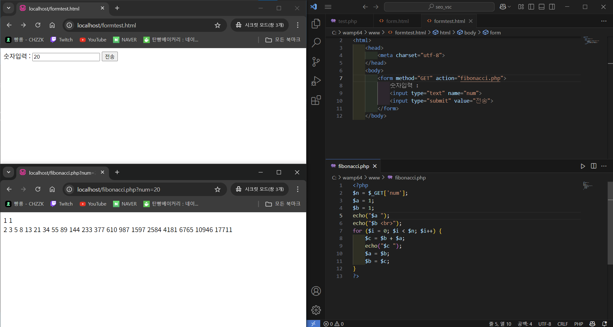
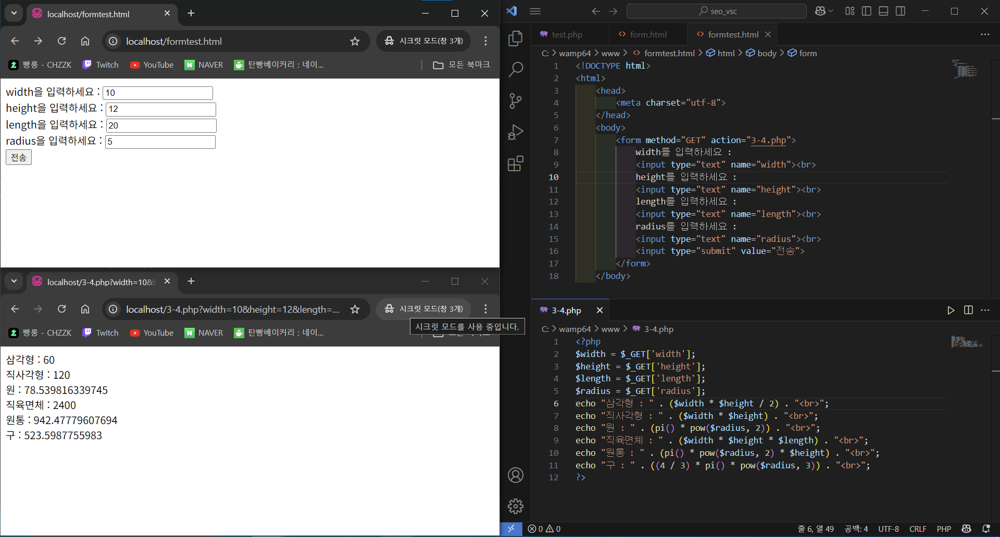
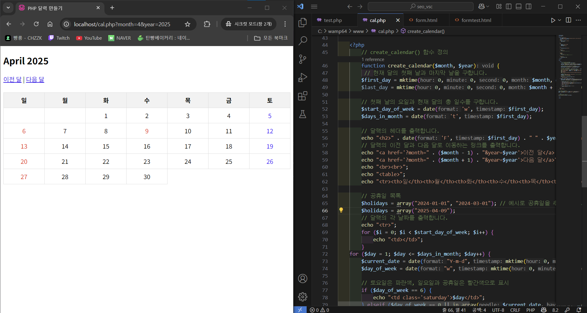

# kinaitosa.github.io
> 20221143 서준영

* * *

- [**homework2-1**](webprograming/homework2-1.html)   
  - [**homework2-1** _0312 강의시간 작성_](webprograming/homework2-1-0312.html)
- [**homework2-2**](webprograming/homework2-2.html)   
- [**homework2-3**](webprograming/homework2-3.html)   
- [**homework2-4**](webprograming/homework2-4.html)
- [**css_demo**](webprograming/css_demo.html)
  

- [**homework3-1**](webprograming/homework3-1.png)

- [**homework3-2**](webprograming/homework3-2.png)

- [**homework3-3**](webprograming/homework3-3.png)

- [**homework3-4**](webprograming/homework3-4.png)

- [**homework3-4**](webprograming/homework3-5.png)

* * *
